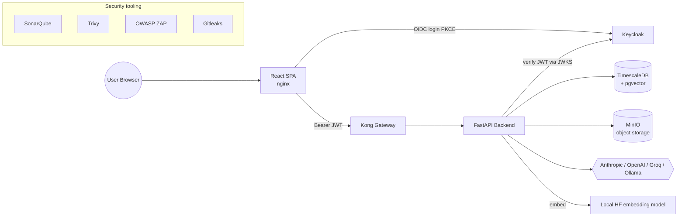
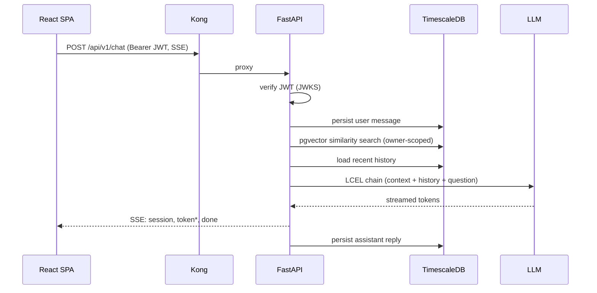
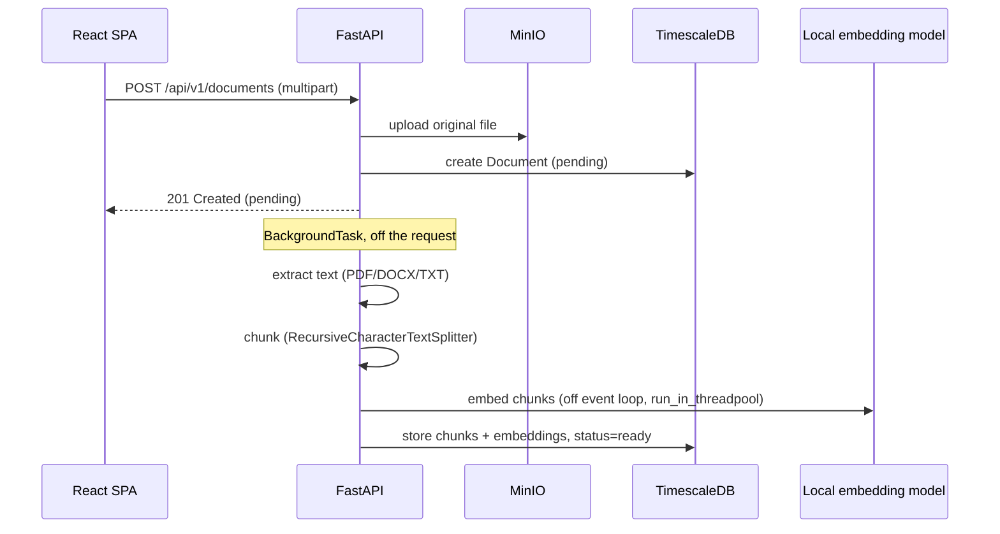

# Architecture

## System overview



| Component | Tech | Role |
|---|---|---|
| Frontend | React 18 + Vite + TypeScript + Tailwind | Chat UI, document upload, Keycloak login |
| Gateway | Kong (OSS) | Routing, CORS, rate-limiting for the API |
| Backend | FastAPI + LangChain (LCEL) | RAG chat, document ingestion, auth |
| Auth | Keycloak | OIDC identity provider |
| Database | TimescaleDB (Postgres) + pgvector | Chat history (hypertable) + document embeddings, one engine |
| Object storage | MinIO | Raw uploaded documents |
| Embeddings | Local HuggingFace model (`BAAI/bge-small-en-v1.5`) | Provider-agnostic, no external API dependency |
| LLM | Anthropic Claude, OpenAI, Groq, or local Ollama (configurable, `LLM_PROVIDER` or per-user) | Chat completion |

## Why these choices

- **pgvector in TimescaleDB, not a separate vector DB.** One database engine
  to run, migrate, and back up. TimescaleDB is genuinely earning its place
  here too, not just hosting vectors: `chat_messages` is a real hypertable
  (see [`app/models/chat.py`](../backend/app/models/chat.py) and the
  migration that converts it), partitioned by time — the natural shape for
  chat history at scale (retention/compression policies, efficient
  time-range queries).
- **Local embeddings, not an API.** Decouples embedding quality/cost from
  whichever chat LLM provider is configured, and keeps ingestion working
  with zero external dependencies beyond the model download itself.
- **Kong doesn't verify JWTs — the backend does.** Kong OSS has no native
  OIDC/JWKS plugin; duplicating verification in two places would just be two
  things to keep in sync for no benefit. Kong's job here is routing, CORS,
  and rate-limiting only. See
  [`infra/kong/README.md`](../infra/kong/README.md).
- **Keycloak gets its own Ingress host**, not a path prefix under the app's
  host — it has too many top-level paths (`/realms`, `/admin`, `/resources`,
  `/js`, ...) to enumerate as ingress rules. This is also *why* the backend
  has two separate Keycloak URL settings (`KEYCLOAK_SERVER_URL` for the
  internal JWKS fetch vs. `KEYCLOAK_ISSUER_URL` for token verification) — a
  container reaches Keycloak over one address, a browser over another, and
  Keycloak stamps the browser-facing one into every token's `iss` claim. Get
  this out of sync and every authenticated request fails with "issuer
  mismatch" — see [`app/core/security.py`](../backend/app/core/security.py)
  and [`infra/README.md`](../infra/README.md).

## Request flows

### Chat



The streaming endpoint deliberately does **not** use the normal
`Depends(get_db)` pattern: FastAPI closes `yield`-dependencies as soon as the
endpoint function *returns* the `StreamingResponse` object, which happens
*before* the body generator actually runs. Both the SSE endpoint and the
document-ingestion `BackgroundTask` instead take a `session_maker` (a
factory, not a session) and open their own session for their own lifetime —
see the comments in
[`app/api/v1/routers/chat.py`](../backend/app/api/v1/routers/chat.py) and
[`app/services/ingestion_service.py`](../backend/app/services/ingestion_service.py).
Both bugs were caught by integration tests exercising the real DI path, not
by code review.

### Document ingestion



## Data model

- **`documents`**: `id`, `owner_id` (Keycloak `sub`), `filename`, `mime_type`,
  `minio_object_key`, `status` (pending/processing/ready/failed),
  `error_message`, `created_at`
- **`document_chunks`**: `id`, `document_id` FK, `chunk_index`, `chunk_text`,
  `embedding vector(384)` (HNSW cosine index), `chunk_metadata` (jsonb)
- **`chat_sessions`**: `id`, `owner_id`, `title`, `created_at`
- **`chat_messages`** (**hypertable**, partitioned on `created_at`): `id`,
  `session_id` FK, `role`, `content`, `created_at`, `token_count`.
  Composite `(id, created_at)` primary key — TimescaleDB requires the
  partitioning column in every unique constraint on a hypertable.
- **`user_llm_settings`**: `owner_id` (PK, Keycloak `sub`), `provider`,
  `encrypted_anthropic_key`/`encrypted_openai_key`/`encrypted_groq_key`
  (Fernet ciphertext, never plaintext — see docs/SECURITY.md), matching
  `*_key_preview` columns (masked display strings, computed once at write
  time so a GET never needs to decrypt anything), `updated_at`. One row per
  user who has configured their own provider via the Settings page; a user
  with no row falls back to the deployment-wide `LLM_PROVIDER` env default.
  Ollama needs no key at all — its availability is checked live instead (see
  `app/services/llm_provider.check_ollama_available`).

## Repository layout

```
backend/    FastAPI + LangChain RAG API — see backend/README.md
frontend/   React + Vite + TypeScript chat UI — see frontend/README.md
infra/      docker-compose, Kong config, Keycloak realm, Helm chart
  ├── docker-compose.yml   one-command local stack — see infra/README.md
  ├── kong/                declarative gateway config
  ├── keycloak/            realm bootstrap — see infra/keycloak/README.md
  ├── security/            ZAP scan script
  └── helm/                Kubernetes chart — see infra/helm/README.md
docs/       This directory
postman/    Postman collection — see postman/README.md
.github/    CI workflows (ci.yml, security.yml)
```

## Auth model

Every protected route depends on
[`get_current_owner_id`](../backend/app/core/security.py), which verifies the
request's Bearer JWT against Keycloak's JWKS (RS256; issuer, audience, and
expiry all checked) and returns the token's `sub` claim as the owner id.
Documents and chat sessions are scoped to that id at the repository layer —
see `document_repository.py`/`chat_repository.py` — so one user can never see
another's data through the API, verified by
`test_documents_are_scoped_to_owner` in the integration suite.

## Testing strategy

90% backend coverage (34 tests), 5 frontend tests — see
[`docs/SECURITY.md`](SECURITY.md) for the security-tool side of testing.
Backend integration tests use `testcontainers` to spin up real TimescaleDB and
MinIO containers rather than mocking them out — this is what caught three of
the real bugs mentioned above (two DI bugs, one Kubernetes volume-ownership
issue), none of which a mock-based test would have surfaced.
